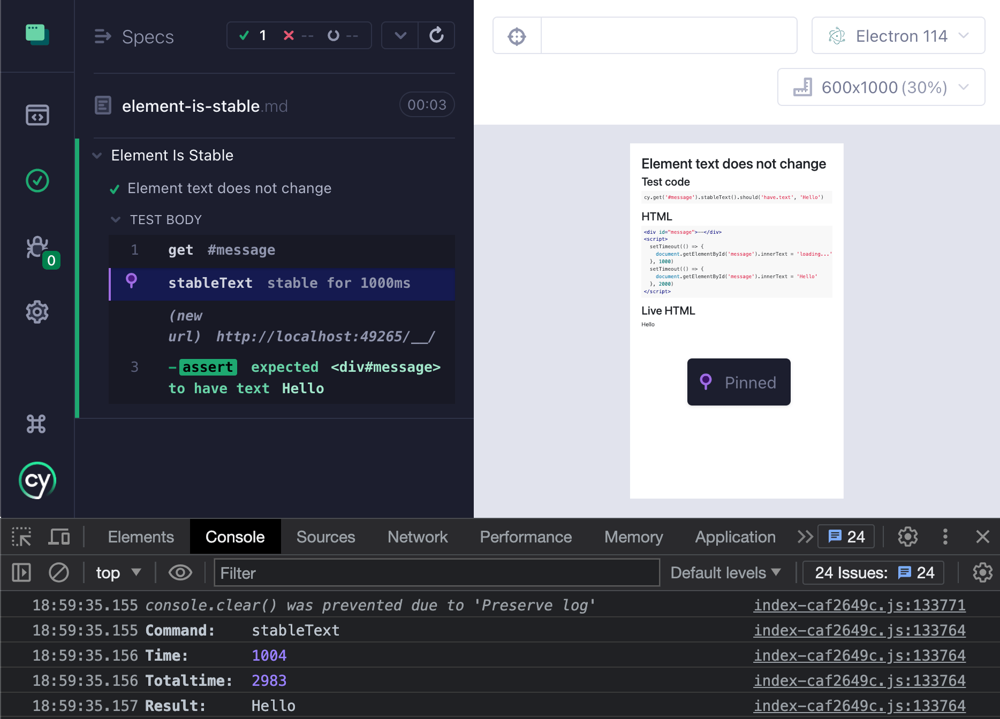

# Element Is Stable

Sometimes the element changes and we want to continue testing it once it stabilizes. Let's see how we can write such tests.

📺 Watch this recipe explained in the video [Element's Text Becomes Stable](https://youtu.be/GrRUnQ2r7Wk).

## The text does not change for N milliseconds

<!-- fiddle Element text does not change -->

In this example, I want to wait for the given element to stop changing its text N milliseconds.

```html
<div id="message">--</div>
<script>
  setTimeout(() => {
    document.getElementById('message').innerText = 'loading...'
  }, 1000)
  setTimeout(() => {
    document.getElementById('message').innerText = 'Hello'
  }, 2000)
</script>
```

```js hide
Cypress.Commands.addQuery('stableText', (ms = 1000) => {
  const log = Cypress.log({
    name: 'stableText',
    message: `stable for ${ms}ms`,
  })
  console.log(log)
  let started = null
  let initialText = null
  let initialAt = null
  // return a function that receives an element
  // from the previous command and can check its text
  // if it not stable yet, just throw an error
  // to force the parent command to retry
  return ($el) => {
    if (initialText === null) {
      started = +new Date()
      initialText = $el.text()
      initialAt = started
      console.log('started with text "%s"', initialText)
      throw new Error('start')
    }
    if ($el.text() === initialText) {
      const now = +new Date()
      if (now - started > ms) {
        console.log(
          'after %dms stable text "%s"',
          now - started,
          initialText,
        )
        log.set('consoleProps', () => {
          return {
            time: now - started,
            totalTime: now - initialAt,
            result: initialText,
          }
        })
        // yield the original element
        // so we can chain more commands and assertions
        return $el
      } else {
        throw new Error('waiting')
      }
    } else {
      started = +new Date()
      initialText = $el.text()
      console.log('text changed to "%s"', initialText)
      throw new Error('reset')
    }
  }
})
```

Get the element, wait for the text to be stable, and confirm the text is "Hello".

```js
cy.get('#message').stableText().should('have.text', 'Hello')
```

If we click on the command, we see the details in the DevTools console



<!-- fiddle-end -->

## Using cy.stable command

My plugin [cypress-map](https://github.com/bahmutov/cypress-map) includes the `cy.stable` child query command.

<!-- fiddle cy.stable / text does not change -->

```html
<div id="message">--</div>
<script>
  setTimeout(() => {
    document.getElementById('message').innerText = 'loading...'
  }, 1000)
  setTimeout(() => {
    document.getElementById('message').innerText = 'Hello'
  }, 2000)
</script>
```

```js
cy.get('#message')
  .stable('text', 1500)
  .should('have.text', 'Hello')
```

<!-- fiddle-end -->
