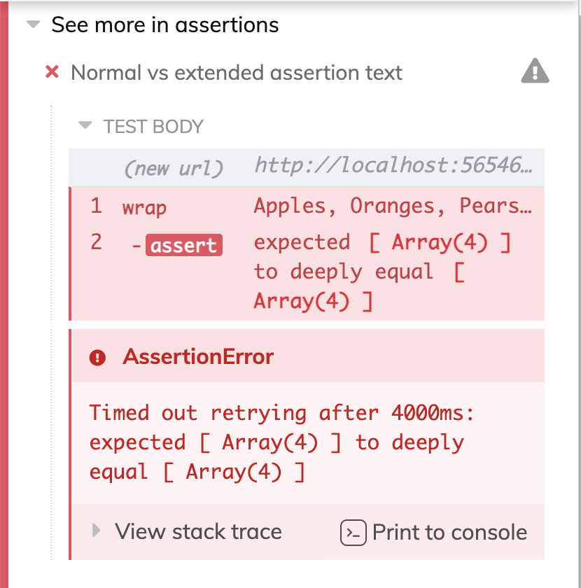
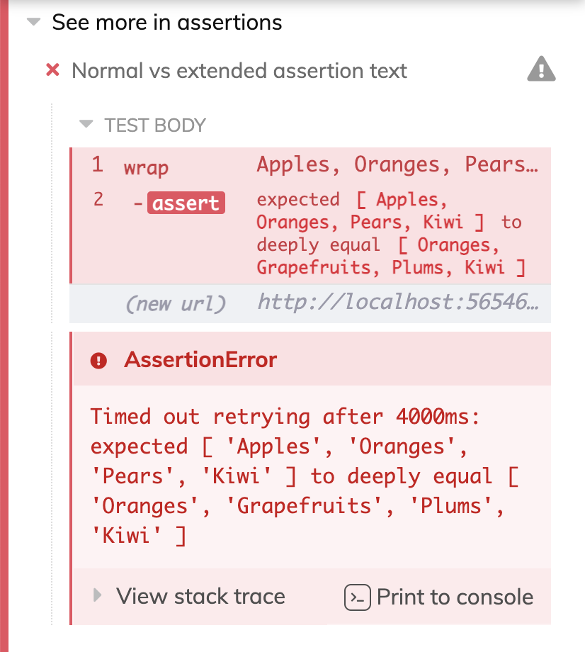

# See more in assertions

<!-- fiddle Normal vs extended assertion text -->

If the expected and actual values make a longer message, the error message is truncated.

```js
const fruits = ['Apples', 'Oranges', 'Pears', 'Kiwi']
```

```js skip
cy.wrap(fruits).should('deep.equal', [
  'Oranges',
  'Grapefruits',
  'Plums',
  'Kiwi',
])
```



You can control the truncate limit, it is part of the `chai.config` object


```js skip
chai.config.truncateThreshold = 200
cy.wrap(fruits).should('deep.equal', [
  'Oranges',
  'Grapefruits',
  'Plums',
  'Kiwi',
])
```

<!-- fiddle-end -->

The full error message shows the two arrays now



Watch the video [Increase Chai Truncate Threshold To Show More Information](https://youtu.be/BuSBVc3d99Y)
